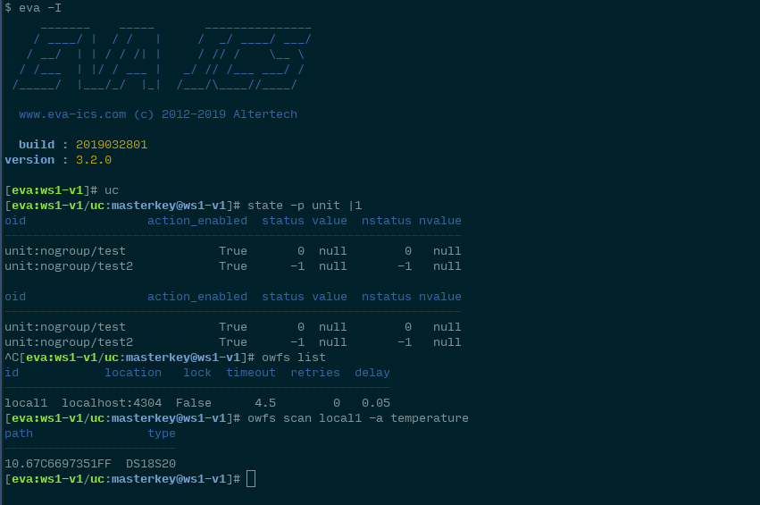

Command line interfaces
***********************

.. contents::

EVA command line apps
=====================

EVA apps are used to configure the system and call controller API functions
from the command line or by external scripts. All of the following apps are
located in **bin** folder.

EVA shell
---------

EVA shell (**eva-shell**, **eva -I** or **eva** for single commands) is the
primary CLI tool. It allows you to manage local system as well as calling other
tools/subshells directly from CLI interactive command line.

With EVA shell you can install updates, backup and restore configuration,
start and stop EVA components.

EVA shell provides commands for all EVA ICS API methods, auto completion for
everything, command repeat, batch commands and is the recommended way to
configure, manage and monitor EVA ICS nodes from command line.

    with EVA shell, IoT management is a joy

Universal Controller
--------------------

* **uc-cmd** manages :doc:`/uc/uc` (equal to *eva uc*)
* **uc-notifier** configures UC :doc:`notification system</notifiers>` (equal
  to *eva ns uc*)
* **uc-tpl** generate and validate :ref:`device templates<device>`

Logic Manager
-------------

* **lm-cmd** manages :doc:`/lm/lm` (equal to *eva lm*)
* **lm-notifier** configures LM PLC :doc:`notification system</notifiers>`
  (equal to *eva ns lm*)

SCADA Final Aggregator
----------------------

* **sfa-cmd** manages :doc:`/sfa/sfa` (equal to *eva sfa*)
* **sfa-notifier** configures SFA :doc:`notification system</notifiers>` (equal
  to *eva ns sfa*)

Registry management
-------------------

* *eva-registry* primary :doc:`registry</registry>` management tool

* *sbin/eva-registry-cli* fast command-line tool for scripting, use
  AUTO_PREFIX=1 env. variable to set *eva3/<SYSTEM_NAME>/* key prefix
  automatically.

Other
-----

* **test-uc-xc** a special app to test UC :doc:`item scripts</item_scripts>`.
  Launches an item script with UC :ref:`cvars<uc_cvars>` and EVA paths set in
  the environment.

Device control apps
===================

EVA distribution includes pre-installed samples for device controlling. All
sample scripts are located in **xbin** folder

TCP/IP controlled relays
------------------------

* **EG-PM2-LAN** controls `EG-PM2-LAN Smart PSU
  <http://energenie.com/item.aspx?id=7557>`_
* **SR-201** controls the SR-201 relay controllers - a quite popular and simple
  solution with TCP/IP management option

1-Wire (direct access via GPIO)
-------------------------------

* **w1_ds2408** controls `Dallas
  DS2408 <https://datasheets.maximintegrated.com/en/ds/DS2408.pdf>`_-based
  relays on the local 1-Wire bus
* **w1_therm** monitors `Dallas DS18S20
  <https://datasheets.maximintegrated.com/en/ds/DS18S20.pdf>`_, DS18B20 and
  other compatible temperature sensors on the local 1-Wire bus
* **w1_ls** displays the devices connected to the local 1-Wire bus
