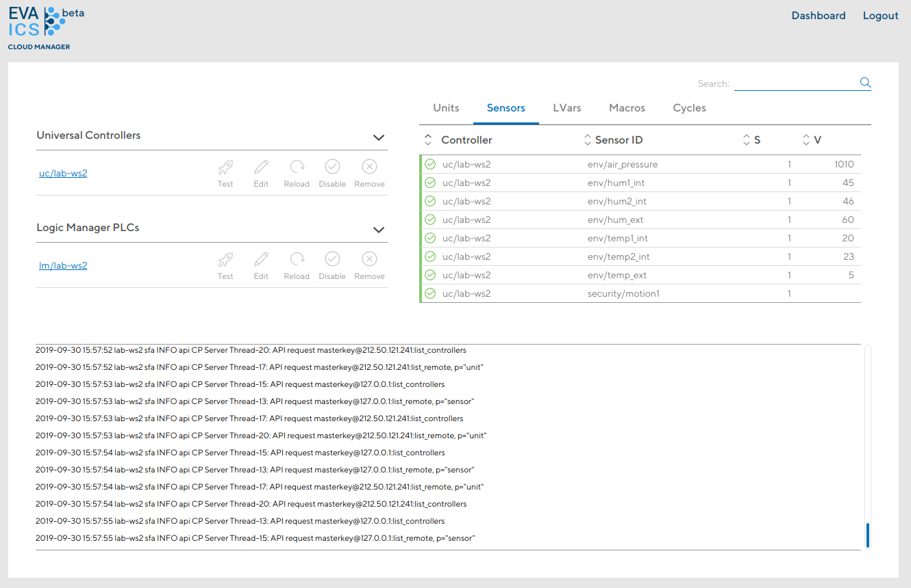
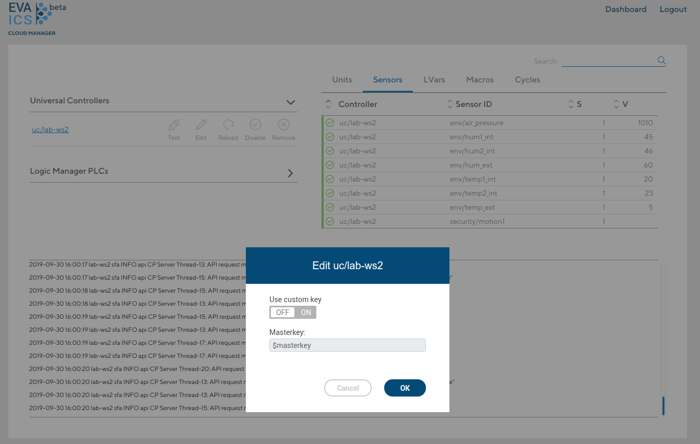

Cloud Manager
*************

If *cloud/cloud_manager* option is enabled in :doc:`/sfa/sfa` configuration
the whole EVA ICS setup can be monitored and managed via the web interface.

Cloud manager can be accessed at *http://<SFA_IP>:8828/cloudmanager* by users
with master key assigned. Such user can be created in :doc:`CLI </cli>` or
master API keys can be directly used to login.

Dashboard
=========

Cloud Manager dashboard displays all resources, available for :doc:`/sfa/sfa`
where Cloud Manager is running on.

Controller management
=====================

Connected controllers can be also managed. :doc:`/sfa/sfa` must know controller
master API key to connect and manage remote controller.

If Cloud Manager was not enabled during the installation, master keys should be
entered manually by pressing "edit" button in the controller table. By default,
the local master key is used.

