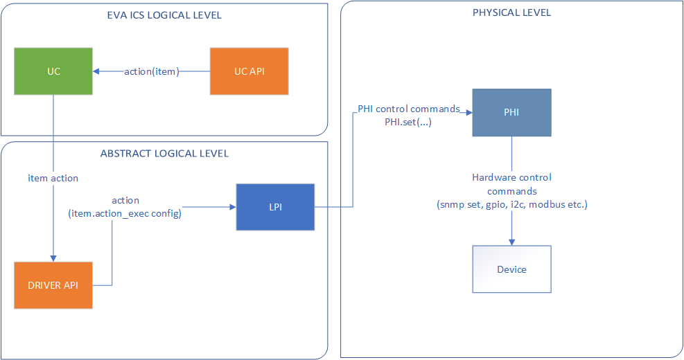
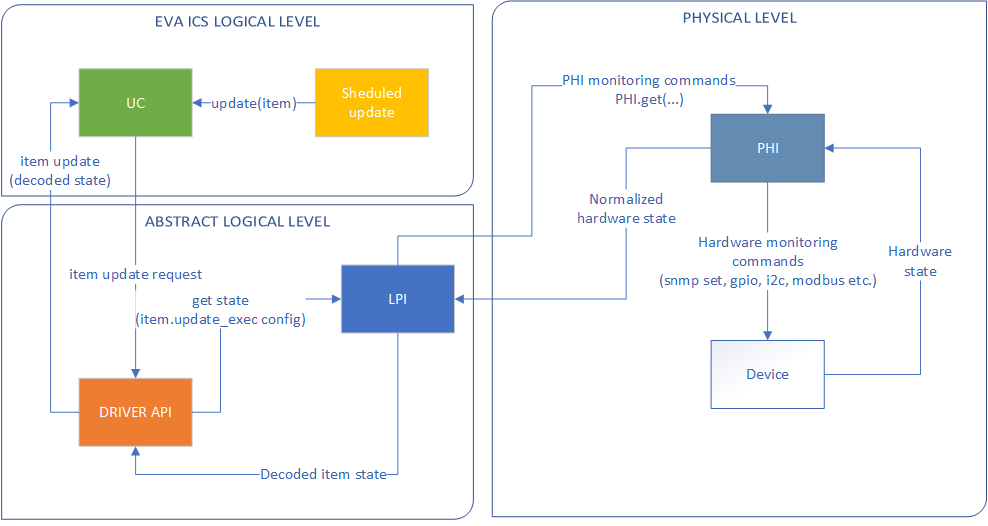
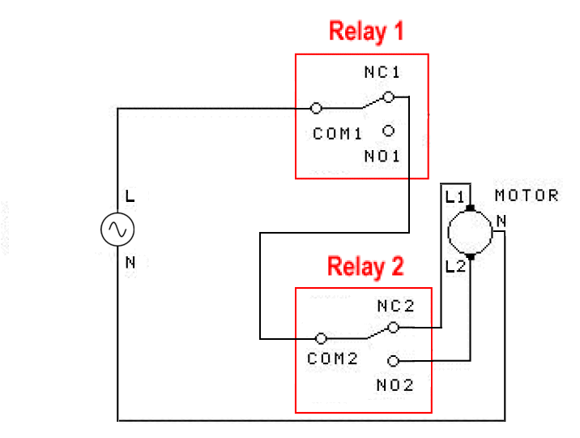
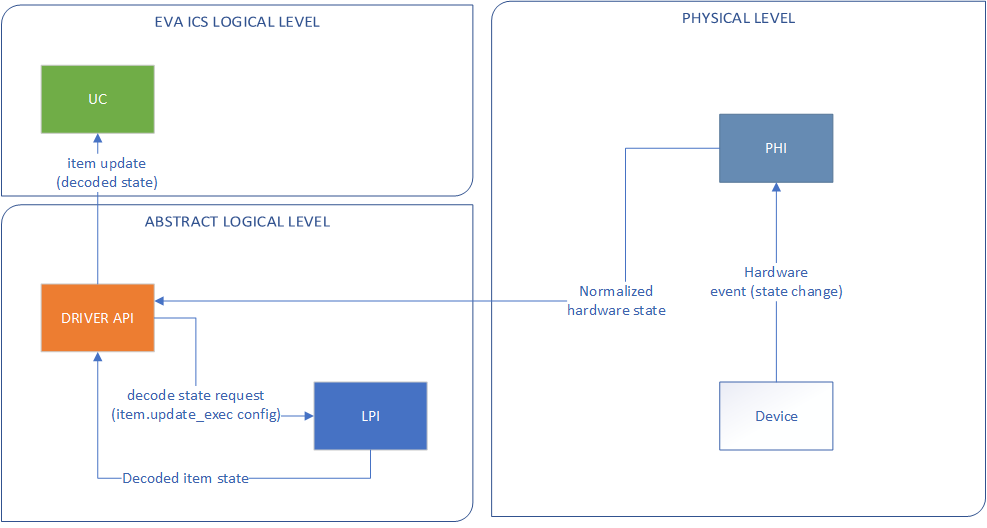

Drivers
*******

:doc:`/uc/uc` uses 2 ways for controlling and monitoring items:
:doc:`item scripts</item_scripts>` and drivers. Drivers are the most advanced
way, they are faster, contain all process logic and can be used to work with
devices on a single bus, providing locking/unlocking mechanisms.

Code of driver is executed directly inside the controller core and unlike
script can't be terminated, unless it gets termination signal and decides to
stop. If driver process causes timeout and there is no way to stop it,
controller raises a critical exception and may terminate itself.

You should always use only reliable and tested drivers, otherwise your system
may become unstable.

.. _driver:

Structure
=========

Each driver contains **2 modules**: LPI (logical to physical interface) and PHI
(physical interface). To load new driver into controller, follow the steps:

List the available PHI mods:

.. code-block:: bash

    eva uc phi mods

Get PHI module information:

.. code-block:: bash

    eva uc phi modinfo <phi_module>

If the desired PHI is not listed, download it and put to *xc/drivers/phi*
folder. Official PHI modules are available at `<https://www.eva-ics.com/phi>`_.
You may either download the module manually or use

.. code-block:: bash

    eva uc phi download <phi_module_uri>

command. Note that UC host doesn't need to have a direct connection to the host
you download PHI from, module is downloaded first to the host where *eva* CLI
(or *eva uc*) is started, verified and then automatically uploaded to the
controller.

Execute the command to list PHI configuration variables:

.. code-block:: bash

    eva uc phi modhelp <phi_module> cfg

This will display the configuration variables, used when PHI is loaded (port
numbers, default values etc.). Variables marked *required=True* should be
always defined otherwise controller will fail to load PHI.

Load PHI with the following command:

.. code-block:: bash

    eva uc phi load <phi_id> <phi_module> [-c config] [-y]
    # example
    eva uc phi load v1 vrtrelay -c default_status=1,update=5 -y

Param *-y* is used to ask the controller to save driver configuration right
after PHI is loaded.

After the successful load, PHI will automatically create the most suitable
driver for itself, called *<phi_id>.default*. This usually provides basic
driver logic and doesn't mean the driver is suitable for your task. You may
replace it's LPI module or define a different driver with another LPI.

To assign driver to the specified item, use the command:

.. code-block:: bash

    eva uc driver assign <item_id> <driver_id> [-c config] [-y]
    # example, set test_lamp to 5th relay port of driver v1
    eva uc driver assign unit:lamps/test_lamp v1.default -c port=5

Param *-y* is used to ask the controller to save item configuration right after
driver is assigned.

Param *-c* is used to set driver configuration for the specified item: set
port, logic etc.

Advanced usage: EVA :doc:`item</items>` can have different drivers or scripts
for actions and updates. To assign different drivers, modify item properties
**action_exec**, **update_exec**, **action_driver_config** and
**update_driver_config** (e.g. with *eva uc config props*). Driver is assigned
to the property with *|driver_id* value, e.g. *|v1.default*.

.. note::

    All :ref:`custom-defined user variables<uc_cvars>` are always passed to
    driver function calls, which allows to set some device-specific or
    logic-specific options as global or for the particular item group.

    How the driver handles action commands

Note that params started with **_** are passed to PHI calls directly (without
**_** prefix), this allows specifying different hosts, bus addresses (if PHI is
developed as "universal") without a need to load different drivers for each
item.

    How the driver handles update commands

Use commands *eva uc phi unload* and *eva uc phi unlink* to unload and unlink
unnecessary PHI modules, but note that driver and PHI can't be unloaded while
they're assigned to items. You must first assign a different driver to the item
or use *eva uc driver unassign* command.

You can load PHIs/drivers with the same IDs even if they are already present in
the system without unloading them first. In this case, new
modules/configuration replace the old ones.

.. _lpi:

Logical to physical interfaces (LPI)
====================================

LPI module handles the whole driver logic and doesn't contain any code,
specific for the equipment. All it needs is to process the logic and call the
assigned PHI.

When the controller loads new PHI, it creates a driver called <phi_id>.default,
assigning LPI to provide basic functionality, but you may want to replace it or
use different logic for different items.

To list available LPI mods, use the command:

.. code-block:: bash

    eva uc lpi mods

To get module information, use the command:

.. code-block:: bash

    eva uc lpi modinfo <lpi_module>

Currently we don't provide any additional LPI modules or SDK, all available
mods are included in EVA ICS distribution.

To get additional module info, use the following commands:

.. code-block:: bash

    # list module configuration options
    eva uc lpi modhelp <lpi_module> cfg

    # list module options used when action is called
    eva uc lpi modhelp <lpi_module> action

    # list module options used when state update is called
    eva uc lpi modhelp <lpi_module> update

Configuration options are used when you load a driver (e.g. to modify LPI
default behavior), separated with commas.

Action and update options are used when you assign a driver to the specified
item; separate them with commas. Options marked *required=True* should be
always defined.

Let's see what modules are available.

basic LPI
---------

Basic status on/off LPI module, used to control simple devices which have only
status *0* (OFF) and *1* (ON), i.e. lamps, relay ports (directly) etc.

Used in default drivers for relay, sockets and similar PHIs, doesn't need to be
configured when loaded.

When assigning driver containing **basic** LPI mod to the specified item
(*eva uc driver assign*), the assigning configuration should contain port
number (*-c port=N*) which usually matches the physical relay port.

Port number can be specified as a list (*-c port=N1|N2|N3*), in this case all
listed ports will be used in commands.

.. note::

    If relay port number is specified as i:N e.g. i:2, LPI commands will
    consider it is inverted (falling edge) meaning *0* is for *on* and *1* is
    for *off*. This works both for **basic** as well as for any other relay
    control LPI.

sensor LPI
----------

Basic sensor monitiring, used to get data from specified sensors.

Used in default drivers for sensors, doesn't need to be configured when loaded.

LPI does not provide *action* functionality. When assigning driver containing
**sensor** LPI mod to the specified item (*eva uc driver assign*), the assign
configuration should contain a port or a bus address number.

ssp LPI
-------

Similar to **sensor** LPI, but doesn't contain any options at all. Used when
PHI can work only with one physical equipment (e.g. sensor with TCP/IP API) and
all equipment options are already set in PHI.

esensor LPI
-----------

Sensor monitoring with advanced functions. Can monitor physical sensor groups
returning average, maximum or minimum value. Can ignore sensor values if they
seem to be invalid in case one or several sensor in a group fail (while there
are enough working sensors in a group).

Configuration options (set with *eva uc driver load*):

* **skip_err** If *True*, failed physical sensor in a group will be skipped,
  otherwise EVA sensor item gets error value.

* **gpf** Group port function, get values from the sensors in a group, then
  return:

  * **avg** average value
  * **max** maximum value
  * **min** minimum value
  * **first** first available value from any working physical sensor

* **max_diff** maximum value difference until the sensor in a group is marked
  as failed and its value is ignored. E.g.: set this option *10* and let it
  poll the temperature sensors group. All sensors with temperature difference
  *10* degrees or more from the average are ignored.

Update options (set with *eva uc driver assign*):

* **port** driver port or ports (array). If you use multiple ports (group),
  they should be separated with pipes (**|**) for the items. Group separation
  for EVA multiupdate items should be made with double pipes (**||**)

* any configuration option (optional). E.g. if *gpf=avg* is defined, it
  overwrites default LPI behavior for the specified item.

multistep LPI
-------------

Module used for such common tasks as door or window opening. To use this module
you must connect your equipment to 2 relay ports: one will give power to
motors, the second will set the direction.

    AC motor circuit

Configuration options (set with *eva uc driver load*):

* **bose** (break on state error). The module requires to know the current door
  or window position is. If you set this option to *True* and  the current item
  status is error, the action will be not executed. Otherwise LPI will pass and
  consider the item status is *0*.

* **logic** *default* or *rdc* (reversible DC motor circuit). If set to
  *rdc*, LPI will set *port* = 1, *dport = 0* for "opening" and *port = 0*,
  *dport = 1* for "closing".

.. figure:: schemas/rdc_motor.png
    :scale: 75%
    :alt: reversible DC motor circuit

    Reversible DC motor circiut

Action options (set with *eva uc driver assign*):

* **port** contains one or several (separated with **|**) relay ports used to
  power a motor (or plus for reversible DC).

* **dport** contains one or several (separated with **|**) relay ports used to
  set a direction (or minus for reversible DC).

* **steps** list of float numbers, contains time (in seconds) of power access
  period to the motor to reach the next step. E.g. you have a door with 3
  positions: closed, half-open and completely open. **steps** option will
  contain 2 numbers (e.g. *20|25*) which tells LPI the door state from *0* to
  *1* is changed by running motor for *20* seconds, the state from *1* to *2*
  is changed by running motor for *25* seconds, so LPI can automatically
  calculate the full opening/closing cycle is *45* seconds.

* **warmup** float number (seconds). LPI will add this value to the time for
  running the motor if the state is neither *fully open* nor *fully closed*, to
  let it "warm up" before doing actual work.

* **tuning** float number (seconds). LPI will add this value to the time, if
  action is *open full* or *close full* to make sure the door is fully
  open/closed.

* **ts** (to-start) number which indicates the following: e.g. you have a door
  with status from *0* (fully closed) to *5* (fully open) and defined the
  middle states with **steps**. But when calling action "set this door to *2*"
  you can't be sure the door position is equal when setting it from *fully
  open* and *fully closed*. But if you set e.g. *ts=2* and the current status
  is greater than *2*, it will tell LPi firstly to completely close the door
  (go to *status=0*) and then go to *status=2*.

* **te** (to-end) same as **ts** but in an opposite way: set the status number,
  starting from which the door will be fully open first, then go to the desired
  status.

.. note::

    LPI will completely refuse to run the action if it calculates that therese
    is not enough time to complete it. Set unit **action_timeout** to the
    proper value.

Update options:

The module doesn't provide any state update functionality. If you want to sync
door/window item states with real, use separate reed switch sensor.

Loading driver with the chosen LPI
----------------------------------

Firstly, you can list available LPIs with the command:

.. code-block:: bash

    eva uc lpi mods

Consider the desired PHI is already loaded. To load the driver and combine
PHI+LPI, use the command:

.. code-block:: bash

    eva uc driver load <phi_id>.<lpi_id> <lpi_module> [-c config] [-y]
    # in example, for PHI loaded as "v1":
    eva uc driver load v1.ms multistep -c bose=true -y

.. _phi:

Physical interfaces (PHI)
=========================

PHIs are modules, which contain no data processing logic but code to work
directly with hardware equipment.

We provide a basic set of PHIs for the popular automation equipment (at
`<https://www.eva-ics.com/phi>`_), but if your equipment isn't supported, it's
not so hard to :doc:`develop your own PHI</phi_development>`.

We've already described how to :ref:`get and load PHIs<driver>`, here is some
additional important information.

Universal PHIs
--------------

If the word "universal" is listed in PHI features, it means the module can be
loaded once and provide interface for all supported equipment. E.g. let's take
a look on **sr201** PHI module which provides support for SR-201 compatible
relays:

.. code-block:: bash

    # get PHI module info
    eva uc phi modinfo sr201

    # get PHI configuration help
    eva uc phi modhelp sr201 cfg

    # get PHI options for obtaining the data
    eva uc phi modhelp sr201 get

    # get PHI options for setting the data
    eva uc phi modhelp sr201 set

All of **cfg**, **get** and **set** have an option **host** which should be
defined ether in PHI configutation (*eva uc phi load* with *host* config option
or in the item driver configuration (*eva uc driver assign* with *_host* config
option). Setting a different **host** option value in the item driver
configuration lets one *sr201* PHI manage all available SR-201 relays.

Physical events
---------------

If the word "events" is listed in PHI features, it means the module can handle
hardware events e.g. react to the alarm sensors or update item state when an
external event is received.

    How the driver handles physical events

In practice, it means PHI provides data, obtained from the hardware, to
controller and asks it to update all items using drivers which contain PHI
module which have an event.

When doing update, drivers LPI modules don't ask PHI to get hardware data
working only with data already provided by the hardware.

Drivers and multi updates
-------------------------

If the word "aao_get" is listed in PHI features, it means you don't need to
create multiupdates in :doc:`/uc/uc` to update several items at once. "aao_get"
(all-at-once-get) means PHI can obtain all hardware data itself and then ask
the controller to update all items using drivers which contain PHI equally to
updating on physical events.

How to use this feature: All PHIs with "aao_get" feature also have
configuration param named *update* which means how frequently (in seconds) PHI
should collect data from the equipment and initiate item updates. *update*
value should be defined in PHI load config and be greater than zero.

Example:

.. code-block:: bash

    eva uc phi load relay2 sr201 -c host=192.168.20.2,update=5 -y

As soon as the driver is assigned to item (*eva uc driver assign*), it starts
getting state updates every *5* seconds.

Testing PHIs and additional PHI commands
----------------------------------------

As soon as PHI is loaded, you can test how it works. All PHI modules respond to
the command:

.. code-block:: bash

    eva uc phi test <phi_id> self

which returns result *"OK"* or *"FAILED"*.

PHI can provide additional testing; to get a list of testing commands, execute:

.. code-block:: bash

    eva uc phi test <phi_id> help

Some PHIs can provide additional commands to set up or control the hardware
equipment. To get a list of these commands, execute:

.. code-block:: bash

    eva uc phi exec <phi_id> help

Example: PHI module **dae_ro16_modbus** has a command to change Modbus unit ID
of the hardware equipment. Let's change unit ID to *5*:

.. code-block:: bash

    eva uc phi exec <phi_id> id 5

The module will flash new unit ID into hardware and change unit ID in self
configuration. Don't forget to restart the hardware to let it be accessed with
new unit ID and save PHI config (*eva uc save*).

