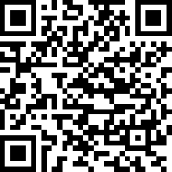

Mobile clients
**************

Android
=======

EVA ICS Control Center client
-----------------------------

You can use official `EVA ICS Control Center client
<https://play.google.com/store/apps/details?id=com.altertech.evacc>`_ to access
:doc:`SFA</sfa/sfa>` UI from Android-based mobile phones.

The client is evaHI-based application, so it can be `configured in the same way
<https://github.com/alttch/evaHI#create-configuration-file-on-your-web-server>`_

:doc:`SFA</sfa/sfa>` automatically maps *ui/.evahi* directory to */.evahi* URI.
If front-end server is used, URI should be accessible without user
authentication to let all application features work properly.

:ref:`js_framework` function *$eva.hiQR* can be used to generate configuration
QR code for the current authenticated user.

.. youtube:: 1yU3oEUMQpQ

Building own client
-------------------

You can easily build custom Android client for your EVA ICS UI, customizing
application class, name, menu, icons. Please refer to
`evaHI <https://github.com/alttch/evaHI>`_ building instructions.

Authentication
--------------

evaHI sends username/password only if basic authentication is set up. However
API login method automatically detects evaHI client (by HTTP *User-Agent*
header) and ask it to provide authentication credentials.

If there is no front-end with basic authentication set up for all clients, you
may display log in form for all, but let evaHI-based clients to try logging in
automatically via :ref:`js_framework`:

.. code-block:: javascript

    if ($eva.in_evaHI) {
        $eva.start();
    } else {
        // show login form
    }

Apple iOS and other mobile platforms
====================================

Currently we have no plans to release native iOS client, iPhone users may
access :doc:`SFA</sfa/sfa>` UI via 3rd-party apps or built-in mobile browser.

