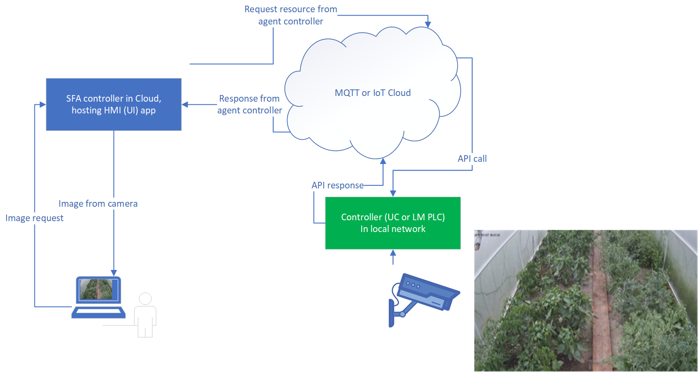

CCTV Cameras
************

EVA ICS has built-in tools to put image from CCTV cameras on HMI dashboards.

.. contents::

Uploaded images
===============

Consider there's a camera in a local network, which continuously uploads images
to local folder on the host where :doc:`/sfa/sfa` is installed.

You can insert newest uploaded image into web interface via :doc:`/sfa/sfa_pvt`:

**Step 1: Setup source**

Setup CCTV camera to upload images via FTP or SCP to pvt folder e.g.
*/opt/eva/pvt/camera1* or make there a symlink to the folder where images are
located.

**Step 2: set API key permissions**

E.g. you want to obtain camera image from pvt folder with API key *operator* or
with user this API key is assigned to:

.. code:: bash

    eva -I
    sfa
    key set operator pvt "camera1/#" -y

**Step 3: insert image into web UI**

Let's insert image, compress it to 90% and resize to 640x400. Camera image URL
will be:

.. code::

    /pvt?k=APIKEY&f=camera1/*.jpg&c=newest&ic=resize:640x400:90:jpeg&nocache=RANDOM

If you use :ref:`js_framework` or ready-made HMI application, parameter
*k=APIKEY* is not required. Parameter *nocache* should always be present to let
JavaScript reload image into web browser.

Image in local network
======================

Consider there's a CCTV camera in local network on IP address *192.168.1.110*,
which provides current image at (e.g.):

.. code::

    http://192.168.1.110/axis-cgi/jpg/image.cgi # old AXIS cameras
    http://192.168.1.110/onvif/snapshot/pic.jpg # modern ONVIF cameras

You can insert image into web interface with :ref:`SFA RPVT<sfa_rpvt>` tool:

**Step 1: set API key permissions**

E.g. you want to obtain camera image with API key *operator* or with user this
API key is assigned to:

.. code:: bash

    eva -I
    sfa
    key set operator rpvt "192.168.1.110/onvif/snapshot/#" -y

**Step 2: insert image into web UI**

.. code::

    /pvt?k=APIKEY&f=http://192.168.1.110/onvif/snapshot/pic.jpg&ic=resize:640x400:90:jpeg&nocache=RANDOM

As well as for **pvt**, if you use :ref:`js_framework` or ready-made HMI
application, parameter *k=APIKEY* is not required.

Image in 3rd party network
==========================

Consider :doc:`/sfa/sfa` is installed in Cloud or in the network **A**, which
doesn't have direct access to CCTV camera in network **B**.

If :doc:`/uc/uc` or :doc:`/lm/lm` is installed in network **B** and connected
to :doc:`/sfa/sfa`, we can ask controller in network **B** to be our agent and
provide camera image (as well as any other resource from network **B**) for
SFA.

The task we are going to solve is pretty complex but it allows to transfer
image from camera without VPN, port-forwarding. But keep resources in network
**B** secure and avoid any unauthorized access.

**Step 1: prepare agent controller**

Put *sysapi/rpvt: yes* field in *config/uc/main* :doc:`registry</registry>` key
(for UC or *config/lm/main* for LM PLC) to enable rpvt agent feature. Restart
the controller to activate it:

.. code:: bash

    eva uc server restart

**Step 2: configure access from SFA to agent controller**

Consider SFA is connected to UC with API key named *default*. Set up API key
permissions on a node in network **B**:

.. code:: bash

    eva -I
    uc
    key set default rpvt "192.168.1.110/onvif/snapshot/#" -y

Now remote SFA in network **A** can call agent controller in network **B** to
get image from *http://192.168.1.110/onvif/snapshot/pic.jpg*. As well as ask
agent controller to resize and compress it before transferring.

**Step 3: set SFA API key permissions**

E.g. you want to obtain camera image from SFA in network **A** with API key
*operator* or with user this API key is assigned to:

.. code:: bash

    eva -I
    sfa
    key set operator rpvt "uc/controller_id:129.168.1.110/onvif/snapshot/#"

Where *controller_id* - ID of agent controller in network **B**, as it seen by
SFA (verify it with command *eva sfa controller list*).

**Step 4: insert image into web UI**

.. code::

    /rpvt&k=APIKEY&f=uc/controller_id:192.168.1.110/onvif/snapshot/pic.jpg&ic=resize:640x400x90:jpeg&nocache=NOCACHE

Note that image is resized and compressed on the agent controller, which
reduces network bandwidth and speed up resource loading. Make sure agent
controller host as enough CPU resources to serve the image.

Image from password-protected camera
====================================

Camera image URL can be password protected, usually with basic authentication.
As :doc:`/sfa/sfa_pvt` can not obtain resources from password-protected URLs,
you need to proxy camera image to SFA or agent controller host.

We recommend to use a tiny tool called `CCTV proxy
<https://pypi.org/project/cctvproxy/>`_ which can easily solve this problem.
Note that image from camera will be available for anyone who's logged into
the host where SFA or agent controller is installed, so it's highly recommend
to check shell permissions for all users and set up *CCTV proxy* to listen on
*127.0.0.1* only.

Video streams
=============

Video stream from modern cameras can be inserted into web UI with *<video />*
HTML5 tag. However as video stream (and possible required transcoding) eats a
lot of resources, we strongly recommend to insert static images only,
refreshing them with the required period, unless you have a dedicated server
for CCTV and video stream is really required on HMI dashboard.

EVA ICS doesn't provide any tools for video stream proxying/transcoding.
