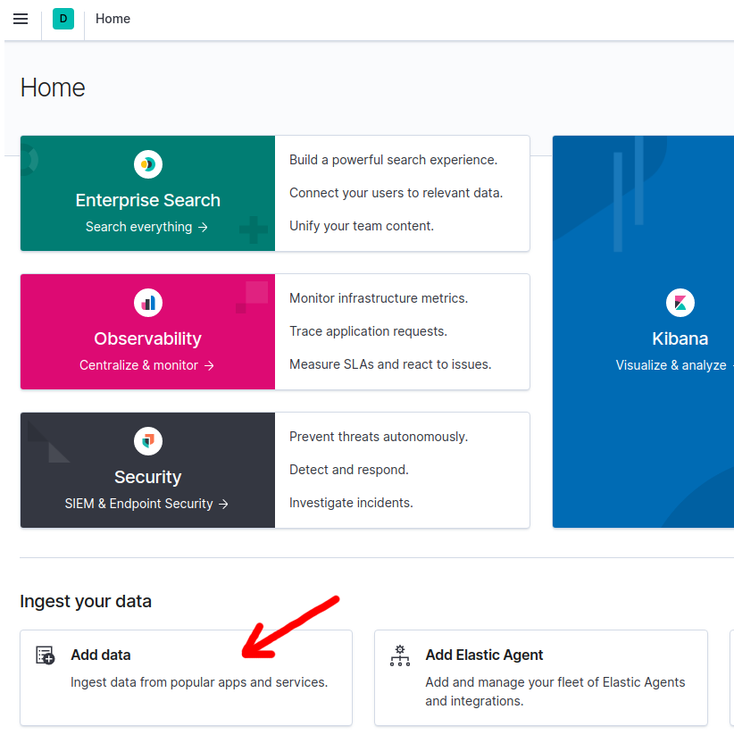
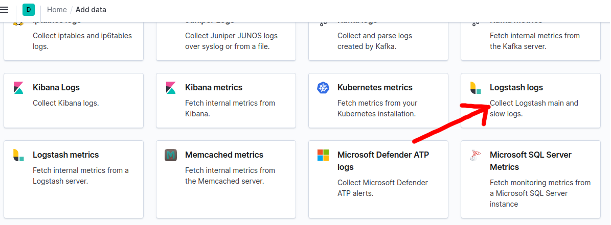

Elastic (ELK)
*************

EVA ICS logs can be viewed/processed with `Elastic <https://www.elastic.co>`_.

EVA ICS can output JSON logs to syslog, but ELK syslog agent can not parse JSON
syslog messages. This document explains how to setup ELK to parse EVA ICS file
logs.

Prepare EVA ICS
===============

For all configured node components (*config/<controller>/main*
:doc:`registry</registry>` keys).

.. code-block:: yaml

    log_format: { "loggerName":"%(name)s", "@timestamp":"%(asctime)s", "pathName":"%(pathname)s", "logRecordCreationTime":"%(created)f", "functionName":"%(funcName)s", "levelNo":"%(levelno)s", "lineNo":"%(lineno)d", "time":"%(msecs)d", "levelName":"%(levelname)s", "message":"%(message)s" }

make sure "log_file" options are also set, and restart EVA ICS services

.. code:: bash

    eva server restart

Configure ELK
=============

- Install ELK stack on some machine

- On the main Elastic dashboard, press "add data"

- Select "Logstash logs"

- Follow the given instructions and setup **filebeat** on all EVA ICS nodes.

- Add the following section into "/etc/filebeat/filebeat.yml" on each EVA ICS
  node:

.. code:: yaml

    - type: log
      enabled: true
      paths:
        - /opt/eva/log/*.log
      json.keys_under_root: true
      json.message_key: "message"
      json.overwrite_keys: true

- Configure "output.elasticsearch" section to let **filebeat** sink logs into
  the ElasticSearch instance.

- Restart **filebeat**:

.. code:: bash

    systemctl restart filebeat

- EVA ICS log messages should immediately appear in ElasticSearch/Kibana.
