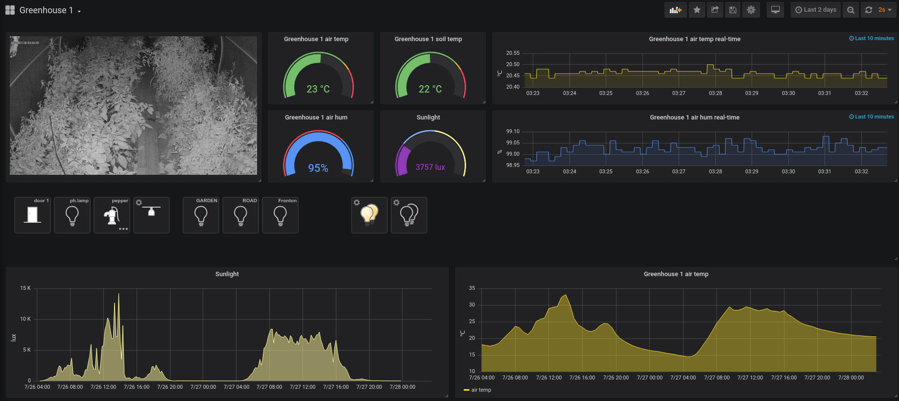

Grafana
*******

`Grafana <https://grafana.com/>`_ is well-known open platform for beautiful
analytics and monitoring.

Data
====

* It's recommended to exchange data with Grafana either via
  :ref:`InfluxDB<influxdb_>` or via :ref:`Prometheus<prometheus_>`.

* After database :doc:`notifier</notifiers>` creation, EVA ICS immediately
  starts sending metrics to the specified database.

* Create data source in Grafana.

* EVA ICS :doc:`item</items>` metrics automatically appear in Grafana and ready
  to be selected.

* To put current item state on Grafana dashboard (e.g. to gauge), use *last*
  value, e.g. for InfluxDB:

.. code:: sql

    SELECT last("value") FROM "sensor:env/temp1"

Controls
========

Custom UI
---------

You can develop any custom EVA ICS UI and then put it into iframe on Grafana
dashboard via `Grafana AJAX
Plugin <https://grafana.com/grafana/plugins/ryantxu-ajax-panel>`_.

* Install :ref:`js_framework`

* Develop custom web UI and put it into */opt/eva/ui* folder

* Install AJAX plugin:

.. code:: bash

    grafana-cli plugins install ryantxu-ajax-panel
    systemctl restart grafana-server

* Create new visualization in Grafana and embed your custom web UI via iframe.

HMI Block UI
------------

* Install `EVA HMI Block UI <https://github.com/alttch/eva-hmi-block_ui>`_:

.. code:: bash

    cd /opt/eva/ui
    mkdir -p apps
    cd apps
    git clone https://github.com/alttch/eva-hmi-block_ui.git

* Follow `HMI Block UI documentation
  <https://eva-hmi-block-ui.readthedocs.io>`_ and configure it / create
  interface pages.

* Install AJAX plugin:

.. code:: bash

    grafana-cli plugins install ryantxu-ajax-panel
    systemctl restart grafana-server

* Create new visualization in Grafana and embed your custom web UI via iframe.
  Look `HMI Block UI
  embedding
  <https://eva-hmi-block-ui.readthedocs.io/en/latest/overriding.html#embedding>`_
  documentation section for example.

Custom resources
================

To put custom resource on dashboard (e.g. chart from private local network or
camera image), use AJAX plugin together with :doc:`/sfa/sfa_pvt`.
