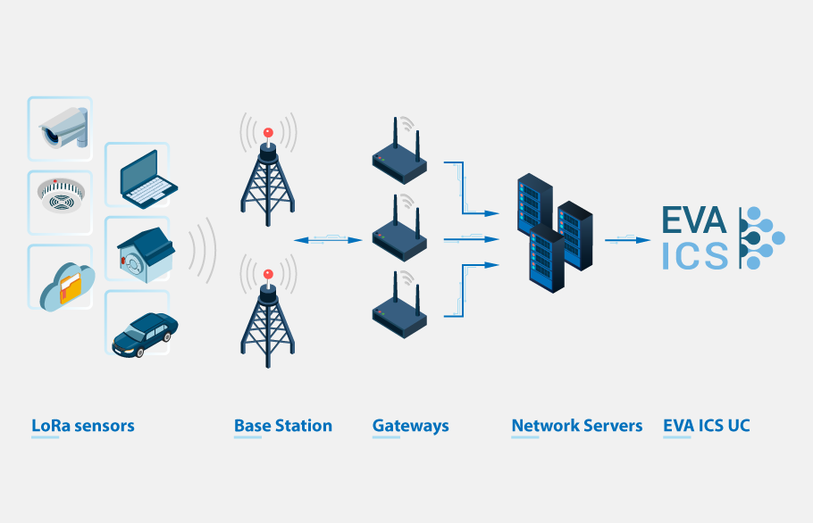
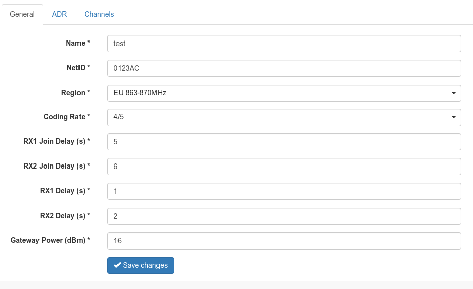
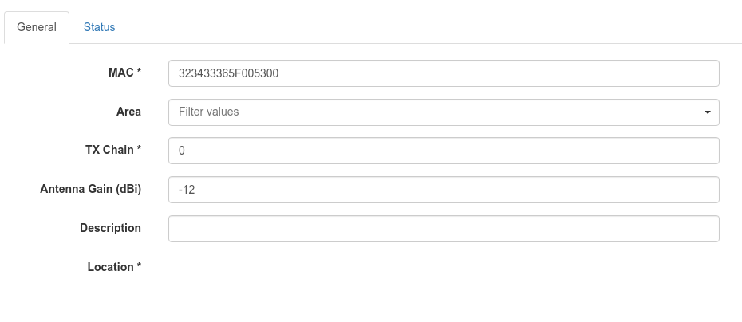
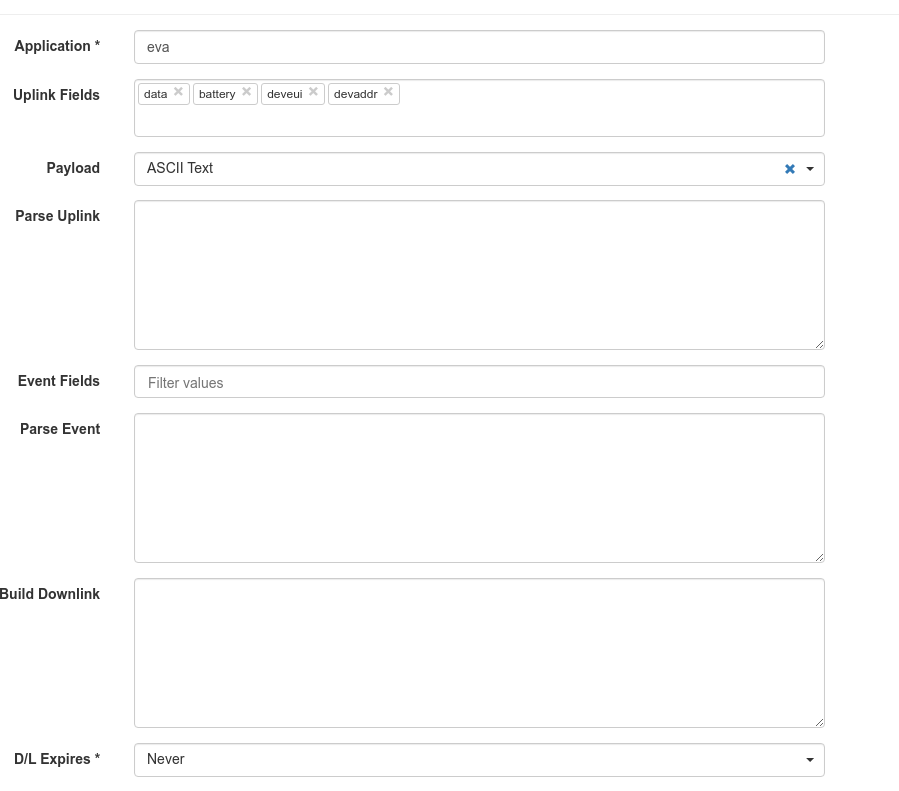
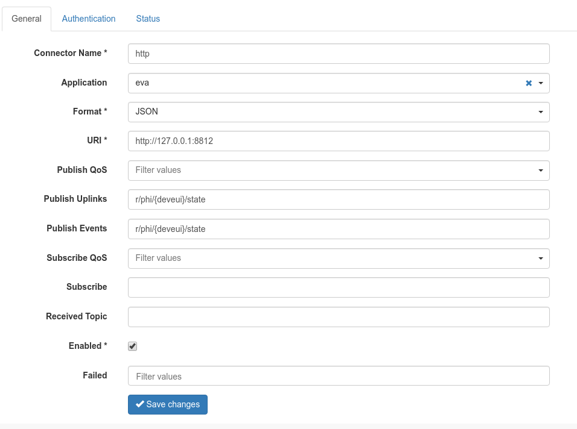
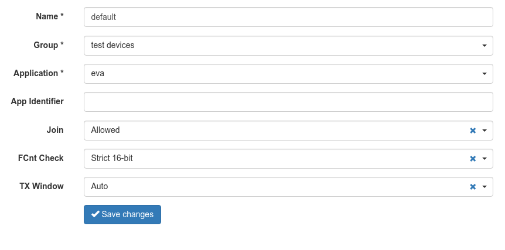
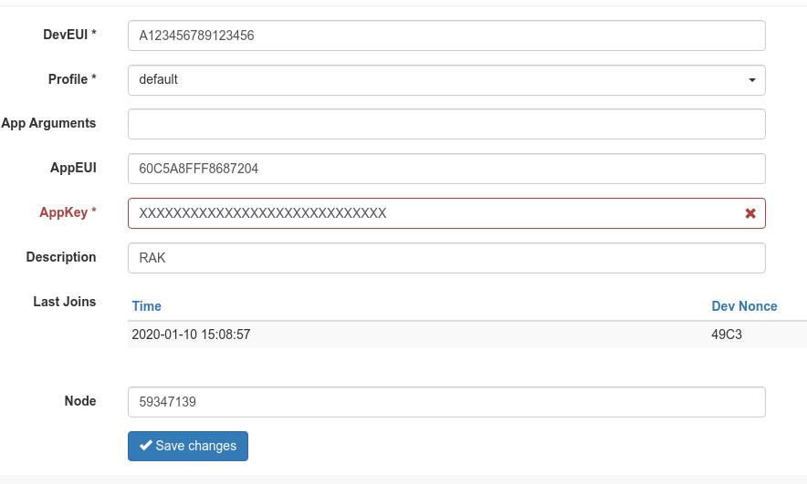

LoRaWAN
*******

EVA ICS can work as `LoRaWAN <https://en.wikipedia.org/wiki/LoRa>`_ application
server for private LoRa networks.  :doc:`PHI modules</drivers>` can either
collect metrics from MQTT server or receive direct HTTP push messages with
state payload.

.. contents::

Requirements
============

Hardware
--------

To connect LoRaWAN sensors, you need LoRa gateway and LoRa network server
installed. For both tests and production we use `MikroTik LoRa products
<https://mikrotik.com/products/group/lora-products>`_ but you may use any
gateway, available on the market.

Network server
--------------

Here's an example, how to configure lightweight `gotthardp LoRaWAN Server
<https://github.com/gotthardp/lorawan-server>`_ with EVA ICS:

Installation
~~~~~~~~~~~~

The software has pre-built *deb* packages for Debian & Ubuntu. Please refer to
installation manual how to install them.

After installing and starting server, everything is configured via web
interface at **http://localhost:8080**, default username/password is
admin/admin.

Network configuration
~~~~~~~~~~~~~~~~~~~~~

Open *Intrastructure->Network* page and create new LoRa network:

Open *Intrastructure->Gateways* and append your gateways.

Append EVA ICS back-end
~~~~~~~~~~~~~~~~~~~~~~~

We'll use PHI for `RAK7204
<https://doc.rakwireless.com/quick-start/rak7204-lora-environmental-sensor/rak7204-lora-environmental-sensor>`_
environmental sensor. It allows sensor state to be pushed from network server
directly to PHI. Go to the server console, where EVA ICS is installed, and
type:

.. code:: bash

   # download PHI module
   eva uc phi download https://get.eva-ics.com/phi/sensors/lora/lora_rak7204.py
   # load PHI module inside EVA UC. we'll use sensor DevEUI as module id
   eva uc phi load A123456789123456 lora_rak7204 -y
   # PHI provides an access to all ports of RAK7204. In this example we'll use
   # ports "temp" (temperature) and "gas" (gas resistance)
   eva uc create sensor:env/temp1
   eva uc create sensor:env/gas1
   # enable sensors
   eva uc update sensor:env/temp1 -s1
   eva uc update sensor:env/gas1 -s1
   # assign driver to sensors
   eva uc driver assign sensor:env/temp1 A123456789123456.default -c port=temp -y
   eva uc driver assign sensor:env/gas1 A123456789123456.default -c port=gas -y
   # done. the driver will update sensors as soon as it receive telemetry
   # from LoRa network server

Now go back to LoRaWAN network server web interface, open *Backends->Handlers*
and create "eva" application. Make sure "data" and "deveui" fields are
selected:

Then open *Backends->Connectors* and create connector to :doc:`EVA UC
</uc/uc>`:

don't forget to configure connector authentication. EVA ICS API key should have
either permission to all items or to items with group "phi" and item id
"A123456789123456" (PHI id we are going to push data in).

Append sensor to network server
~~~~~~~~~~~~~~~~~~~~~~~~~~~~~~~

Go to *Devices->Profiles* and create profile for the sensors, don't forget to
select "eva" as back-end application:

Then go to *Devices->Comissioned* and add the sensor:

.. note::

   If you need to add multiple sensors, it's better to use LoRaWAN network
   server API instead of the web interface.

That's all. After the sensor join your LoRa network and send state telemetry,
sensors "env/temp1" and "env/gas1" immediately update their values. You may
also check PHI module state manually:

.. code:: bash

   eva uc phi test A123456789123456 get

