Node-Red
********

`Node-Red <https://nodered.org>`_ is a popular logic / event management
software, which can be used in EVA ICS together with :doc:`/lm/lm` or replace
it.

EVA ICS and Node-Red are perfectly compatible. The primary recommended channel
for data communication is MQTT server, while EVA ICS :ref:`units<unit>` can be
controlled either via MQTT or with JSON RPC API (third-party Node-Red component
required: https://flows.nodered.org/node/node-red-contrib-jsonrpc).

This example is considered to be correct for the EVA ICS instance / cloud,
containing at least one :ref:`MQTT notifier<mqtt_>`.

.. youtube:: VT9h1K_D53w

.. note::

    In production environments, it is highly recommended to extend Node-Red
    with third-party custom components, which should provide access control and
    action logging.

Configuring EVA ICS
===================

Create a virtual sensor and a virtual unit:

.. code:: bash

    # create a sensor, no virtual driver required
    eva uc create sensor:tests/temp -yE
    # load a virtual relay driver for units
    eva uc phi load vr1 vrtrelay -y
    # create a unit
    eva uc create unit:tests/vent -yE
    # assign the virtual driver to the unit
    eva uc driver assign unit:tests/vent vr1.default -c port=1 -y
    # allow controlling the unit via MQTT
    eva uc config set unit:tests/vent mqtt_control eva_1:2 -y

Collecting events in Node-Red
=============================

Let us collect events from *sensor:tests/temp* via MQTT. Drop "mqtt in"
component on the flow dashboard:

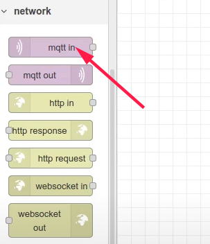

If there is no MQTT server configured yet in Node-Red, press "edit" button and
define a new one:

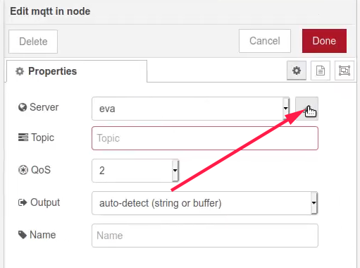

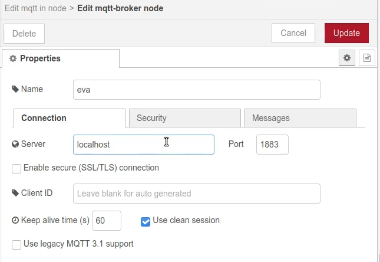

Set MQTT topic, note that ":" in EVA ICS item oid should be replaced with "/".
Set output to "a parsed JSON object":

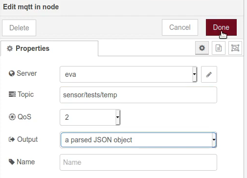

Processing events
=================

Put a processing component on the flow, e.g. a switch, and connect the node
with MQTT input:

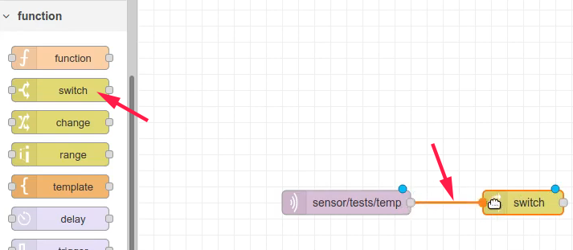

Let us configure the switch to flow the output one if the sensor value is above
or equal 25 and the output two otherwise.

The serialized sensor MQTT event, sent by :doc:`/uc/uc`, looks like:

.. code:: json

    {
        "c": "uc/lab-ws2",
        "status": 1,
        "t": 1611264802.9571016,
        "value": "25"
    }

So:

* Set the Property to "payload.value"

* Set condition value type to "number" to parse sensor value as float:

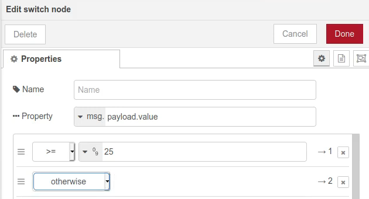

Defining control templates
==========================

The next step is to define a control template. Drop "template" component on the
flow dashboard:

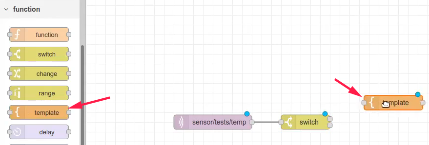

Edit the template node. Let us use the template to turn a unit on by sending an
action to set its status to "1":

* Set name to "ON"

* Set "Output as" to "parsed JSON"

* Put *{ "status": 1 }* JSON into the template body

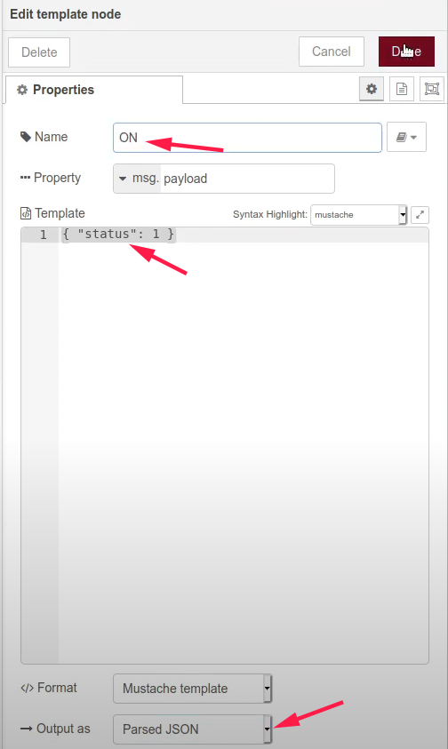

Repeat the same for "OFF" (status=0) action.

Controlling equipment
=====================

.. note:: 

    In production environments it is better to use JSON RPC calls to control
    units, as MQTT actions do not provide any result / feedback.

Put "mqtt out" component on the flow:

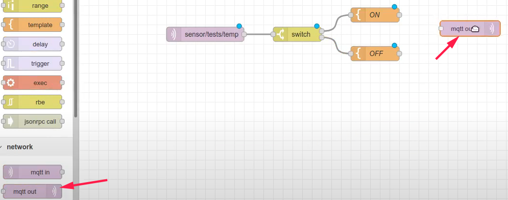

Edit the node, set MQTT topic to "unit/tests/vent/control" (note that ":"
should be replaced to "/" as well and the "/control" suffix is added):

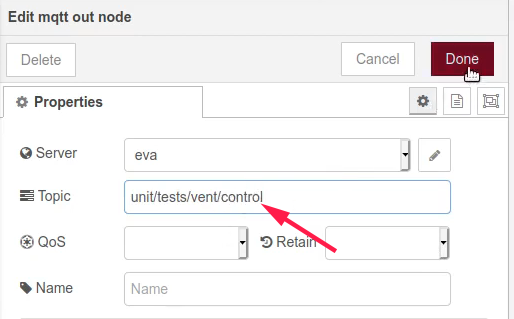

Deploying
=========

Make sure all the flow nodes are connected and press "Deploy" button. Node-Red
flow is ready to process events.

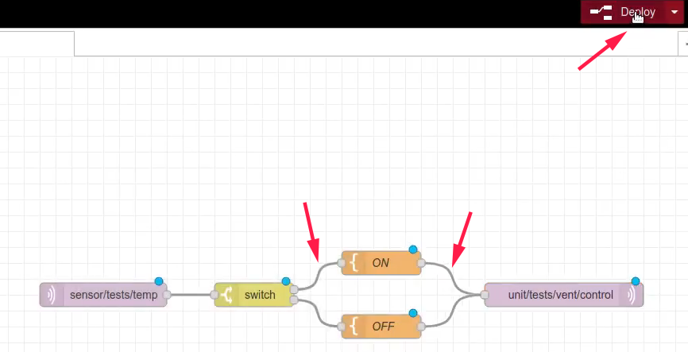
