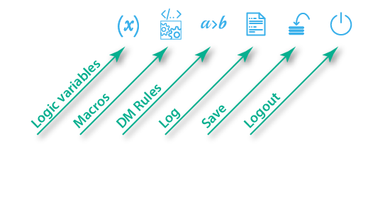
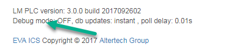
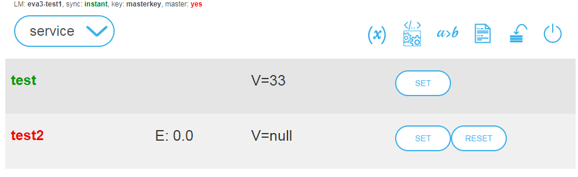
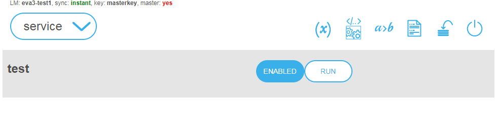
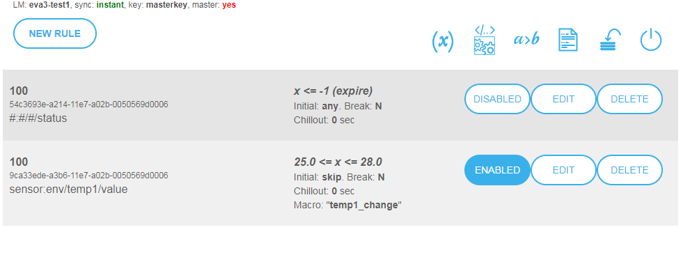
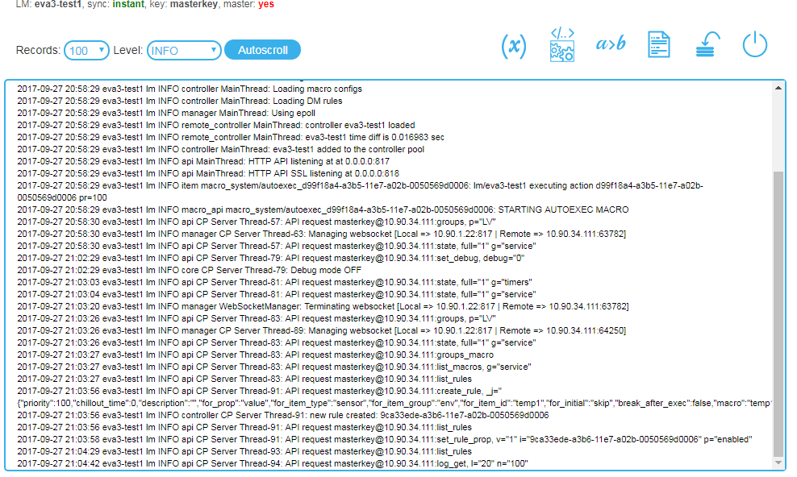

LM EI
*****

LM EI is a minimal interface for controlling the :doc:`lm` subsystem. The
interface is not intended for daily use. It is designed exclusively for
configuration, debugging and use in case of emergency, e. g. when the primary
system interface is unavailable.

Logging in
==========

To log into the interface, open *\http://IP_address_LM:port/* url (the default
port is 8817), enter API key and press Enter to log in or **Remember API key**
to log in and make your browser remember the key.

.. figure:: ../ei-login.png
    :scale: 70%
    :alt: Login page

Navigation
==========

The navigation menu is at the top of the interface.

Use **Save** button to immediately store the runtime data base/configuration to
the disk.

System information
==================

System information is at the bottom of the interface. Clicking on the **Debug
mode** enables or disables the controller debugging mode.

Logic variables
===============

The logic variables (:ref:`lvars<lvar>`) page opens after logging in. On the
top you see the controller name, key type (masterkey or the regular one) and
data synchronization method (instant - via WebSocket, numeric value - via AJAX
every X seconds).

Important: when you create/delete lvars, the interface does not automatically
display the changes made. Use reload button or refresh the page in browser.

Use **SET** button to set status and value of the variable, **RESET** button -
to reset state if the variable is used as timer (sets its status and value to
1).

Macros
======

On the :doc:`macros<macros>` page you can review defined macros.

You can run the macros, enable or disable their execution. As far as macros do
not belong to items sharing their state via :doc:`notification
system</notifiers>` (except for actions), the page doesn't reload any external
changes automatically.

Decision rules
==============

The page displays the :doc:`decision-making rules<decision_matrix>`.

It allows you to add, edit, delete and disable/enable rules of decision-making
matrix. As far as decision-making rules do not belong to items sharing their
state via :doc:`notification system</notifiers>`, the page doesn't reload any
external changes automatically.

Log viewer
==========

The log page allows you to review the system log since the controller launch.
If you set the report level to *DEBUG*, interface automatically prompts you to
switch the controller to debugging mode.

Disabling the interface
=======================

For security reasons, it may be a good idea to disable the interface after the
initial configuration and system debug. To do this, set
*webapi/ei-enabled:false* in *config/lm/main* :doc:`registry</registry>` key
and restart the controller.
