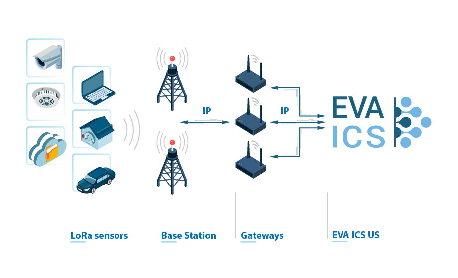

LoRa
****

:doc:`/uc/uc` can act as `LoRaWAN <https://en.wikipedia.org/wiki/LoRa>`_
network server.

Before loading :doc:`drivers </drivers>` for LoRa equipment, LoRaWAN support
must be enabled *etc/uc.ini* configuration file: you should uncomment/change
*listen* and *hosts_allow* options in **[lorawan]** section.

After :doc:`/uc/uc` restart (*eva uc server restart*), loaded LoRa PHIs
immediately start receiving packets from the gateways.

.. note::

   Only LoRa protocol version 2 (1.0.2+) is supported.
