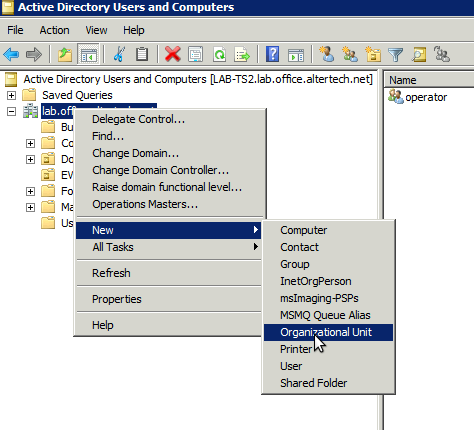
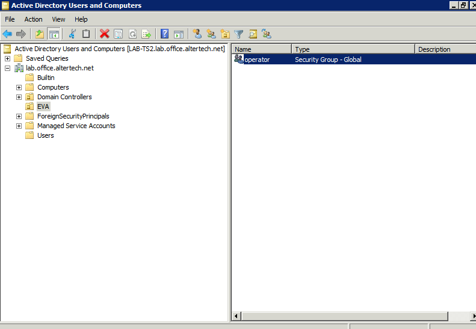

MS Active Directory authentication
**********************************

To authenticate EVA ICS users, `Microsoft Active Directory
<https://en.wikipedia.org/wiki/Active_Directory>`_ can be used.

Active Directory support is not configured by default.

Automatic setup
===============

.. code:: shell

    eva feature setup msad host=192.168.1.15,domain=myorganization.com,key_prefix=msad_

Manual setup
============

System setup
------------

Install LDAP and SASL2 development libraries

.. code:: shell

    apt -y install libsasl2-dev libldap2-dev libssl-dev
    # or for Fedora
    yum install -y openldap-devel openssl-devel

Append **easyad** module to EVA ICS Python venv (*/opt/eva/etc/venv*) extras

.. code:: ini

    EXTRA="easyad==1.0.9"

Rebuild EVA ICS venv

.. code:: shell

    /opt/eva/install/build-venv

EVA Controller configuration
----------------------------

Put the following block in controller configuration (e.g. for
:doc:`SFA</sfa/sfa>` edit *config/sfa/main* :doc:`registry</registry>` key)

.. code:: yaml

    msad:
        host: ad.yourdomain.com
        domain: yourdomain.com
        key_prefix: ""
        ou: EVA
        #ca: /path/to/ca-file.crt
        # cache credentials for the specified time (seconds)
        # default: 86400 (1 day), 0 to disable caching
        #cache-time: 86400

Host and domain should always be specified. Default key prefix is empty,
default organizational unit is *EVA*. CA file is not used by default.

Restart the controller

.. code:: shell

    eva sfa server restart

Configuring multiple domains
----------------------------

To authenticate users from multiple domains, set the "host" parameter as:

.. code:: yaml

    msad:
        host: domain1.com=ad.domain1.com,domain2.com=ad.domain2.com

Optional "domain" parameter can be used to specify the default domain.

.. note::

    Multiple domains authentication can not be set up using "eva feature setup
    msad" command. Please edit controller configs directly.

Active Directory configuration
==============================

Log into Active Directory domain controller, open *Active Directory Users and
Computers* and create organizational unit (default - *EVA*)

Create security groups inside organizational unit. Group name should match EVA
ICS API key ID

Assign security group to domain user. If multiple security groups are assigned, EVA
ICS will use :ref:`combined ACL<combined_acl>`. If API key with any required ID doesn't
exist, authentication attempt is considered as failed, despite user has more
groups assigned.

Usage
=====

Authentication
--------------

After OU security group is assigned to Active Directory user, its credentials
can be immediately used for authentication in EVA ICS. It's not necessary to
create user in EVA ICS controller.

If user with the same login exists in EVA ICS controller, local user has higher
priority. If the provided password doesn't match local, the local record is
ignored and attempt to authenticate via Active Directory is performed.

Users can authenticate either with "login" or with "login\@domain".

If "domain" parameter is specified in the configuration, users can omit domains
in their logins and the default domain is used for authentication.

.. note::

    For cached credentials and 3rd party plugins, "user" and "user\@domain" are
    two different users. If such behavior leads to a logical confusion for 3rd
    party software or UI apps, disable "domain" parameter in the configuration.

If "domain" parameter is not specified, users MUST always specify a domain in
their logins.

Key prefixes
------------

if *key_prefix* is specified in the controller configuration file, EVA ICS will
look for API key with id *{key_prefix}{AD security group}*, e.g.

* key_prefix = msad\_

* user has assigned security group EVA/operator

* EVA ICS controller API key should have id *msad_operator*
