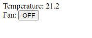

Quick start
***********

Installation
============

Get `any supported Linux distro <https://www.eva-ics.com/download>`_. And
install EVA ICS with the default settings:

.. code:: bash

    curl geteva.cc | sh /dev/stdin -a

The above command prepares the system, installs all EVA ICS components on a
single machine to "/opt/eva" directory and automatically links them together.
"eva" and "eva-shell" commands are automatically added into the system path
with symlinks in "/usr/local/bin".

Alternatively, `EVA ICS docker image
<https://hub.docker.com/r/altertech/eva-ics>`_ can be used.

Task
====

Let us have a temperature sensor and a fan, both controlled with modbus. We
want to:

* Monitor state of both and control the fan from UI

* Turn the fan on when the temperature reaches 25C.

* Turn the fan off when the temperature reaches 22C.

Connecting the equipment
========================

Equipment in EVA ICS is managed by :doc:`/uc/uc`.

.. note::

    It is much faster to use the interactive mode ("eva -I" or "eva-shell"),
    which has auto-completion for everything and other cool features, but in
    this document commands are provided as they should be executed from the
    system shell.

Why command-line? Where is a web interface? Well, EVA ICS has the web
interface: :doc:`/cloudmanager/cloudmanager`. But setting up from command-line
is much quicker and can be also automated with scripts, can't it? Furthermore,
setting up production systems manually is absolutely not recommended, as EVA
ICS has the very powerful and modern :doc:`/iac`.

Download Modbus PHI modules:

.. code:: shell

    eva uc phi download https://get.eva-ics.com/phi/modbus/modbus_xvunit.py
    eva uc phi download https://get.eva-ics.com/phi/modbus/modbus_sensor.py 

Define Modbus virtual port. Consider the bus is on /dev/ttyS0 (system RS-232
port #1):

.. code:: shell

    eva uc modbus create local0 rtu:/dev/ttyS0:8600:8:N:1

.. note::

    If Docker image is used, either map ttyS0 device from the host or run the
    container in privileged mode. If local port is used, either install/run
    EVA ICS under root, or make sure the user has read-write access to the
    device.

Create the items

.. code:: shell

    eva uc create unit:room1/fan --enable
    eva uc create sensor:room1/temp --enable

Define drivers and assign them to the items. Consider the fan control relay is
on Modbus unit 0x01 and is controlled by coil #0 and the temperature sensor is
on Modbus unit 0x02 and its value is stored in holding registers h0-h1 as IEEE
754a 32-bit float.

.. code:: shell

    eva uc phi load mctrl modbus_xvunit -c port=local0,unit=1
    eva uc phi load mmon modbus_sensor -c port=local0,unit=2

    # for modbus drivers, "port" means a register
    eva uc driver assign unit:room1/fan mctrl.default -c port=c0
    eva uc driver assign sensor:room1/temp mmon.default -c port=h0,_type=f32

    # let us query the sensor value every 5 seconds
    eva uc config set sensor:room1/temp update_interval 5

    # check the sensor value
    eva uc state -p sensor

    # turn on / off the fan manually, "-w 5" means wait 5 seconds for the
    # action finish

    eva uc action toggle unit:room1/fan -w 5

    # check the fan (visually and the unit status)
    eva uc state -p unit

Defining logic
==============

Logic in EVA ICS is managed by :doc:`/lm/lm`.

To automatically control the fan, a :doc:`macro </lm/macros>` may be created,
but in this simple example we will call actions directly from :doc:`decision
rules </lm/decision_matrix>`.

.. code:: shell

    eva lm rule create if sensor:room1/temp.value \> 25 then @action\(unit:room1/fan, status=1\) -E
    eva lm rule create if sensor:room1/temp.value \< 22 then @action\(unit:room1/fan, status=0\) -E

As the rules are created from the system shell, do not forget to screen special
symbols with slashes. "@" symbol tells the rule to call macro function
"action" directly, instead of compiling and executing a user-defined macro.

Check that LM PLC has all states from UC:

.. code:: shell

    eva lm remote

If the items are already loaded from UC, their states are synchronized in
real-time on a single machine, the same is when controllers are on different
cloud nodes. Real-time always and everywhere, this is the way EVA ICS works.

.. note::

    The newly created UC items are loaded to LM PLC automatically every 30
    seconds by default. To load them manually, use "eva lm controller reload"
    command.

The logic is ready. LM PLC will monitor the temperature and switch the fan
automatically.

Building a very simple Human-Machine Interface
==============================================

Interfaces and combined API for 3rd-party applications in EVA ICS are provided
by :doc:`/sfa/sfa`.

Check that SFA has all states from UC:

.. code:: shell

    eva sfa remote

Install `EVA JS Framework <https://github.com/alttch/eva-js-framework>`_:

.. code:: shell

    eva sfa server pkg-install -w 60 https://github.com/alttch/eva-js-framework/releases/download/v0.3.24/eva-js-framework-0.3.24.evapkg

By default, EVA ICS creates in SFA "operator" API key and "operator" user, but
let us create a new API key and use it directly:

.. code:: shell

    eva sfa key create op
    eva sfa key set op key 123
    eva sfa key set op groups '#'

.. note::

    The newly crated UC and LM PLC items are synced with SFA automatically
    every 30 seconds. To sync them manually, use "eva lm controller reload"
    command.

Put the following HTML to "/opt/eva/ui/index.html". Any Javascript front-end
interface library can be used, but in this example we will use pure vanilla JS
only:

.. code:: html

    <html>
    <head>
        <title>My first cool EVA ICS HMI</title>
        
    </head>
    <body>
        
Temperature: 

        
Fan:
            <input id="fan" type="button"
                onclick="$eva.call('action_toggle', 'unit:room1/fan')" />

        
    </body>
    </html>

Note that after calling fan actions, UI app does not need to update the button
value. The value is updated in real-time by "$eva.watch" as soon as the server
reports that the action is completed.

Go to http://localhost:8828 (or IP of your system) and HMI application is ready
to go:

That is all. After understanding this simple example, read other sections of
EVA ICS documentation to discover the real power of this mighty open-source
Industry-4.0 automation platform. Good luck!
