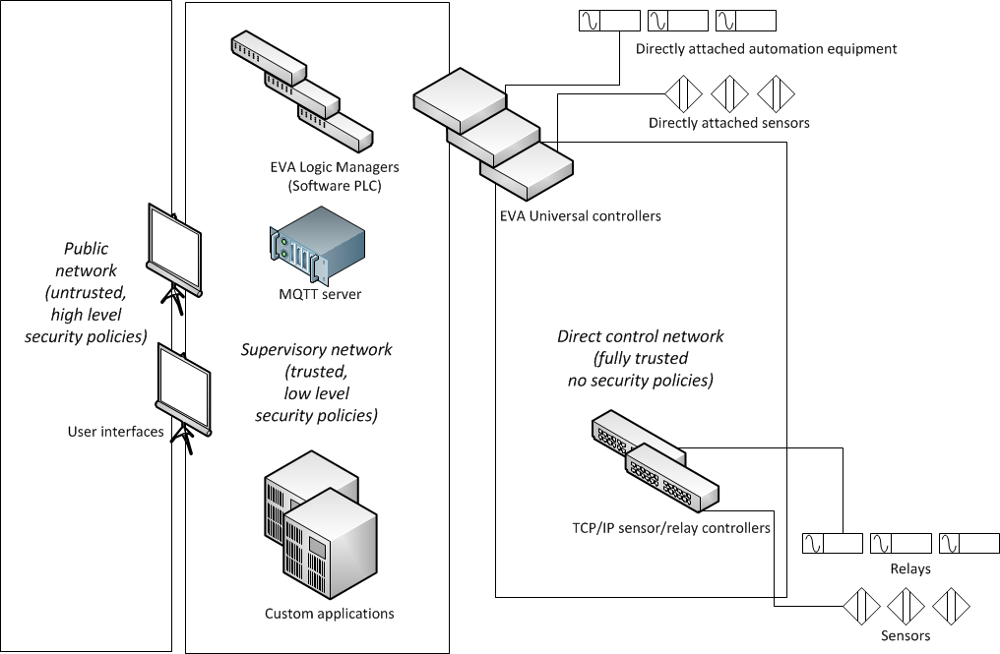

Security
********

General recommendations
=======================

Traditionally, automation systems and protocols have been designed as not
completely secure. As for reliability, you may agree that it would be a pity if
the motor or door gets stuck because of incorrect access rights to a file or an
expired SSL certificate.

:doc:`/uc/uc`, :doc:`/lm/lm`, :doc:`/sfa/sfa` subsystems, as well as their
interfaces, openly exchange API keys. If you do not use SSL, these keys can
easily be caught. That is why only a separate secure network should be used to
connect the controllers in the working configuration. Alternatively, you should
install as many controllers as possible on the same server. Built-in web
interfaces of the individual subsystems are called Emergency Interfaces.
Therefore, they can only be used during primary setup, testing as well
as in case of emergency but not on a regular basis.

All programs and extensions which use API calls should be connected at least
via SSL or, ideally, in a separate secure network.

If you use secure networks or separate VLANs, it is not recommended to use SSL
for API calls to avoid making setup complex and increasing load on your
equipment.

Network design
==============

The recommended enterprise configuration of the system is represented in the
following scheme:

* **Public network** external network (company's local network); applications
  working in a public network (usually SCADA interfaces), should be protected
  from unauthorized access as much as possible: they should use SSL and complex
  passwords and be regularly updated with the latest security patches.

* **Supervisory network** network accessed by authorized company employees
  only; it includes :ref:`MQTT<mqtt_>` (event server), PLC (:doc:`/lm/lm`),
  custom automation applications and "public" interfaces of :doc:`/uc/uc`
  subsystems. The security policies are minimal. They are used not as means for
  protection against hacking, but rather for eliminating the possibility of
  component malfunction. Passwords/keys can be simple, pure HTTP without SSL
  can be used in order to reduce the load and avoid system failure because of
  incorrect certificates.

* **Direct control network** network in which only :doc:`item</items>`
  management controllers operate, e.g. "productional" :doc:`/uc/uc` interfaces,
  TCP/IP-controlled relays, network sensor controllers etc.

In many setups, you may combine Supervisory network and Direct control network
into a single network. As for security, this decision is not that bad, if the
primary goal to divide these networks is comfortable maintenance.

Primary EVA interface is itself rather secure. Still, when connecting via
insecure networks, especially via external Internet connection, it is highly
recommended to:

* use frontend (NGINX, Apache)
* use SSL only (if frontend is present - use it for SSL processing)
* use firewall and forward only one port to the server with an interface

It is strongly recommended to access enterprise configurations with VPN only.

It is not recommended to keep debugging mode enabled in the production system,
because some important data may be recorded in the log files.

Should I run it as root?
========================

* :doc:`/uc/uc` is designed to be run on virtual machines, microcomputers, and
  embedded systems. If server directly controls connected devices, you should
  run it as root in order to avoid any device access errors.  UC security
  bottleneck (when working under root) - API and :doc:`/uc/uc_ei` interface.
  However, you should use API in Supervisory network only and UC EI interface
  should be turned off and used only in case of emergency.

* :doc:`/lm/lm` does not require direct access to the equipment, that is why it
  can be run as root on the selected system (if really required) or as a
  restricted user on the common-purpose servers. If Logic Manager API and
  interface are available only in Supervisory network, this issue is not
  critical for security.

* All external interfaces of the system, including :doc:`/sfa/sfa`, should be
  run only under restricted users and protected with additional frontend and/or
  firewall.

API recommendations
===================

X-Real-IP HTTP header
---------------------

HTTP API uses **X-Real-IP** header variable to determine real IP address of
client when working behind frontend. This can be used by attacker to compromise
real IP address and bypass *hosts_allow*/*hosts_assign* key access control
lists. Frontend should always clear **X-Real-IP** header variable and set it to
the real ip of remote client.

**X-Real-IP** feature is disabled by default. To enable it, set param
*x_real_ip=yes* in *webapi* section of controller configuration file.

Universal Controller API keys
-----------------------------

* The key should contain at least 14 characters, including numbers, lowercase,
  and uppercase letters. Default keys generated during :doc:`easy
  setup</install>` are random sha256 64-byte length hashes, which's more than
  enough for security unless they're transferred between controllers in an
  insecure network and sniffed.

* As far as day-to-day tasks are concerned, it is recommended to use API key
  masterkey (as well as all keys with master rights) only locally or for the
  system configuration/emergency situations.

* For the use of :doc:`/uc/uc_ei` it is recommended to create *operator* key
  with *groups = #, sysfunc = yes* permissions.

* When connecting to :doc:`/lm/lm` and :doc:`/sfa/sfa` it is recommended to
  create a separate key with rights for certain item groups, *sysfunc = no*,
  optionally *allow = cmd*.

* All external applications should have their own keys with restricted access
  rights to the required functions and items only.

Logic Manager API keys
----------------------

* After the initial configuration is complete, it is recommended to connect
  external applications only via keys with certain rights. Master key should
  not be used.

SCADA Final Aggregator interfaces
---------------------------------

* If interface is available from within a public network, you should always use
  frontend with additional authentication

* Private data should be stored on :doc:`SFA PVT</sfa/sfa_pvt>` server or
  protected in other way.

Common API security recommendations
-----------------------------------

If server is present in several VLANs, make sure that API listens only on
Supervisory network address. If you do not use :doc:`UDP API</uc/uc_udp_api>`
or :ref:`snmp_traps` in :doc:`/uc/uc`, disable them in the controller
configuration. Do not enable the remote file control function unless it's
necessary for external apps.

Developer mode
--------------

Every component may be started in a "developer mode": if enabled, all data,
including API keys, is openly written in the log file. That is why we do
not advise you to enable it unless you are our developer or integrator. Still,
as far as the whole system code is open, you can try to enable it on your own
responsibility. Never enable developer mode on the working system and avoid
enabling debug mode as well.

If you contacted the product vendor or integrator who explained to you how to
make a system "dump", you should delete it from the system immediately after
the file is no longer required. "dump" contains plenty of confidential data,
including all API KEYS. Never give dump files to unauthorized persons! This is
the same as giving away all configuration files, including the keys.

Dump file should be sent only via secure channels or in an encrypted form.

