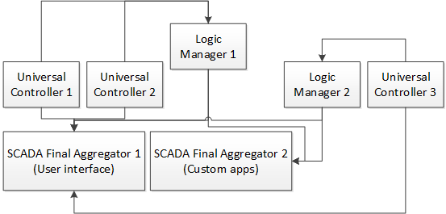

SCADA Final Aggregator
**********************

SCADA Final Aggregator (SFA) is a subsystem usually installed directly in the
host wherein the user interface or third-party applications are installed.

It aggregates all the :doc:`control and monitoring items</items>`, :doc:`logic
macros</lm/macros>` and :doc:`decision rules</lm/decision_matrix>` from all
connected :doc:`UC</uc/uc>` and :doc:`LM PLC</lm/lm>` controllers into one
place. As a result, the final interface or application doesn't need to know
on which controller the :doc:`item</items>` is present, it does all the
function calls directly to SFA. Ids of the items should be always specified in
oid form (*type:group/id*) and be unique in the whole installation.

    Example of the controller aggregation with the use of two SFA servers

SFA is set up and controlled with **eva sfa** :doc:`console application</cli>`
and :doc:`sfa_api`. The API doesn't have a user interface by default, it's
developed specifically for certain installation certain installation using
:doc:`sfa_templates` (server-side part) and :ref:`js_framework` (client-side
part).

All changes of item status, actions, and logs are sent to the
:doc:`notification system</notifiers>`. In addition, SFA can function as the
notification aggregator e. g. by transferring :ref:`MQTT<mqtt_>` messages to
other application via HTTP or redirecting them to other MQTT servers. SFA
usually has several or all available controllers connected. At least one MQTT
server should be installed in the setup to let it work in real time.

Since SFA is a part of EVA platform, its operating principles, settings, and
configuration files generally match the other components.

.. _sfa_config:

config/sfa/main registry key
============================

*config/sfa/main* :doc:`registry</registry>` key contains the controller
configuration.

.. literalinclude:: ../../lib/eva/registry/defaults/config/sfa/main.yml
    :language: yaml

.. _sfa_cvars:

Custom variables
================

Custom variables can be changed while the server is running via :doc:`/sysapi`
as well as :doc:`eva sfa</cli>` **cvar_get** and **cvar_set** commands.

All SFA custom variables are directly available in :doc:`sfa_templates` and
:ref:`js_framework` after login with any valid user or API key.

Variables can be changed while the server is running via :doc:`/sysapi` as
well as :doc:`eva sfa</cli>` **cvar get** and **cvar set** commands.

.. _sfa_remote_c:

Connecting UC and LM PLC controllers
====================================

SFA works only with the :doc:`items</items>` known to the controller. Prior to
connecting :doc:`UC</uc/uc>` and :doc:`LM PLC</lm/lm>` remote controllers, it
is necessary to connect SFA to :ref:`MQTT<mqtt_>` server (via its notification
system), to which other controllers will send the events. SFA reads the list of
:doc:`items</items>`, :doc:`macros</lm/macros>`,
:doc:`rules</lm/decision_matrix>` and the initial item status from the
connected controllers; further status updates are performed via MQTT.

For timers to be displayed correctly in the user interface, it is important to
maximally synchronize the system time between LM PLC and SFA, if LM PLC
controllers are set up on the remote servers.

To connect the controllers you should use **eva sfa** (*sfa-cmd*) :doc:`console
command</cli>` or SFA API :ref:`append_controller<sfapi_append_controller>`
function.

When connecting, it is necessary to indicate minimum URI of the connected
controller and API KEY functioning either as a master key or the key with
access to certain items. If Logic Manager and UC keys are the same, the key can
be set as *$key* (\\$key in the command line). In this case, LM will use the
local key of its own configuration.

.. code-block:: bash

    eva sfa append_controller -u http://localhost:8812 -a secretkey -y
    eva sfa append_controller -u http://localhost:8817 -a secretkey -y

You may specify a controller type with *-g* argument (*-g uc* or *-g lm*). If
the group is not specified, SFA tries to automatically detect the remote
controller type.

Configurations of the connected controllers are stored in the folder
**runtime/sfa_remote_uc.d/** for UC and **runtime/sfa_remote_lm.d/** for LM
PLC.

SFA automatically loads the connected controller data (its id) and saves the
configuration to *runtime/sfa_remote_<type>.d/<ID>.json*.

Items from remote controllers are loaded at the SFA start and then refreshed
with **reload_interval** frequency set individually for each connected
controller. If SFA fails to get the item list during loading, it will use the
existing one.

To control the list of the received items you can use *eva sfa* or
:doc:`/sfa/sfa_api` function :ref:`list_remote<sfapi_list_remote>`:

.. code-block:: bash

    eva sfa remote -p unit
    eva sfa remote -p sensor
    efa sfa remote -p lvar

The available logic macros are listed by the command

.. code-block:: bash

    eva sfa macro list

.. note::

    Macros from **system** group and its subgroups are not loaded to SFA

All connected controllers have the following properties that can be changed
while SFA is running:

* **description** optional description of the controller
* **key** API key used to access the connected controller
* **mqtt_update** :ref:`MQTT notifier<mqtt_>` through which items update their
  status
* **reload_interval**  interval (seconds) to reload the item list from the
  server, 0 - load the list only at the start
* **ssl_verify** either verify or not the SSL certificate validity when working
  through https://. May be *True* (verify) or *False* (not verify) The
  certificate is verified by default.
* **timeout** request timeout (seconds) 
* **uri** API URI of the connected controller (*proto://host:port*, without
  */uc-api/* or */lm-api/*)

Parameters are displayed with **eva sfa** command or :doc:`/sfa/sfa`
:ref:`list_controller_props<sfapi_list_controller_props>` function, modified
with :ref:`set_controller_prop<sfapi_set_controller_prop>`. Function
:ref:`list_controllers<sfapi_list_controllers>` displays the list of all
connected controllers.

To remove the connected controller use
:ref:`remove_controller<sfapi_remove_controller>` function.

When managing the connected controllers, ID should be always provided in the
full format: *controller_type/ID* (i.e.  *uc/controller1*).

Interface
=========

SFA interface is always specifically designed for a certain installation using
:doc:`sfa_templates`, :ref:`js_framework` and :doc:`sfa_pvt`. Interface files
are stored in **ui** folder, interface is available at
*http(s)://<IP_address_SFA:Port>/* (redirects to */ui/*) or
*http(s)://<IP_address_SFA:Port>/ui/*.

Startup and shutdown
====================

To manage SFA controller server, use:

* **eva sfa server start** start SFA server
* **eva sfa server stop** stop SFA server
* **eva sfa server restart** restart SFA server
* **eva sfa server reload** restart controller only (without watchdogs)

The controller startup/shutdown is also performed by **./sbin/eva-control**
which is configured during the :doc:`system setup</install>`.
