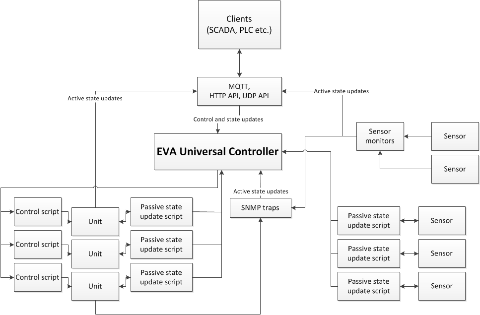

Universal Controller
********************

EVA Universal Controller (UC) is a control and monitoring subsystem.

It should be installed if you actually want to control something. UC is
controlled via :doc:`uc_ei` web interface or :doc:`uc-cmd</cli>` console
application.  Additionally, it can be integrated into other subsystems and
third-party programs using :doc:`uc_api`.

    
    You may use Universal Controller independently or integrate it with
    other EVA subsystems.

:any:`Units<unit>` receive control actions, the controller forms them into
:ref:`queues<uc_queues>` and executes them using external scripts. If
necessary, it terminates the current script and keeps the command history.

Additionally, Universal Controller collects data from the connected
:doc:`items</items>` using active and passive status updates.

Item status and values are stored in the local database. Other subsystems
or third-party programs can read them using :doc:`uc_api`.

Units and :any:`sensors<sensor>` are controlled via :doc:`uc_ei` interface,
:doc:`configured</items>` via :doc:`uc_api`. States are
controlled and updated using :doc:`item scripts</item_scripts>`.

All changes of item status, current control commands, and progress logs are
sent to the :doc:`notification system</notifiers>`.

UC POLL DELAY
=============

EVA is a real-time system. Being one of its essential components, UC also
follows this rule. The value of poll delay is set in configuration in seconds
(milliseconds using dot), e.g. 0.01.

The value of POLL DELAY means that all timeouts and events in the system should
fulfill their functions for not more than TIME_SET + POLL DELAY.

Reducing POLL DELAY will increase the CPU load on the server; in turn, if
increased, the UC reaction time will be longer. Recommended values: 0.1 for
home and office, 0.01 and less - for industrial applications.

The optimum value of POLL DELAY for UC can be set via :doc:`uc-cmd</cli>`, or by
manually calling :doc:`uc_api` functions and comparing reaction/execution time
of the commands.

The minimum value of POLL DELAY is 0.001 (1 millisecond).

.. _uc_ini:

etc/uc.ini configuration file
=============================

uc.ini - primary configuration file of UC server

.. literalinclude:: ../../etc/uc.ini-dist
    :language: ini

.. _uc_cvars:

runtime/uc_cvars.json variables file
====================================

uc_cvars.json - file containing user variables passed to all commands and
:doc:`item scripts</item_scripts>` within the system environment.

The file contains a JSON dict:

.. code-block:: json

    {
     "VAR1": "value1",
     "VAR2": "value2"
    }

Variables can be changed while the server is running via :doc:`/sys_api` as
well as :doc:`uc-cmd</cli>` **cvar_get** and **cvar_set** commands.

For example, let's create a variable:

.. code-block:: bash

    uc-cmd set_cvar -i RELAY1_CMD -v "snmpset -v1 -c private 192.168.1.208 .1.3.6.1.4.1.19865.1.2."

After UC is started, it will become available for system environment, and unit
management script on the port 2 of the given relay will be the following:

.. code-block:: bash

    #!/bin/sh
    ${RELAY1_CMD}.1.2.0 i $2

It's possible to assign different values for the variables used for different
object groups with the same names, e.g. *group1/VAR1*, *group2/VAR1* etc. In
this case the variable will be available only for the specified group.

.. _uc_apikey:

etc/uc_apikeys.ini API keys file
================================

API access keys are stored into *etc/uc_apikeys.ini* file. At least one full
access key named **masterkey** should be present for proper functioning.
Important: with master key and API anyone can receive full access to the system
similar to root user (or the user UC is run under), that is why it is
recommended to use this key only in supervisory networks or even restrict its
use to local host only.

.. literalinclude:: ../../etc/uc_apikeys.ini-dist
    :language: ini

.. _uc_queues:

Action queues
=============

All the unit control actions are queued right after they're created. Item status
update actions are not queued and just run in accordance with the set intervals.

Before execution, the control action is placed in two queues:

* global queue for all actions
* certain unit queue

All actions have their "priority" set when they are generated. The default
priority is 100. The lower means the higher priority of queued action execution.

Queued action can have the following status:

* **created** action has just been created and has not been queued yet
* **pending** the action is placed in the global queue. The previous action
  status, as well as this one, are rarely found because :doc:`uc_api` waits for
  the command to be placed in the queue of a certain unit and then returns the
  result
* **queued** the action has already passed the global queue and is now waiting
  to be executed in the queue of a certain unit
* **refused** unit rejected the action execution because of the item
  configuration value *action_enabled=False*
* **dead** API failed to wait until the action is placed to the queue of a
  certain unit and, therefore, marked it as "dead". Virtually, such status
  clearly indicates that server is seriously overloaded
* **canceled** the command is canceled either from the outside or due to either
  unit already running the other action (in case *action_queue=0* and queue
  is disabled) or the unit has got new action to execute and *action_queue=2*
  (cancel and terminate the pending actions after getting a new one)
* **ignored** the unit rejected the action execution, because its status/value
  are the same as requested to be changed to, and *action_always_exec=False*
* **running** the action is being executed
* **failed** the controller failed to execute the command
* **terminated** the controller terminated the action execution due to timeout
  or by the external request
* **completed** the action finished successfully

Startup and shutdown
====================

To manage UC server use **./sbin/uc-control** script with the following options:

* **start** start UC server
* **stop** stop UC server
* **restart** restart UC server
* **logrotate** call after log rotation to restart the logging
* **version** display the server version

The controller startup/shutdown is also performed by **./sbin/eva-control**
which is configured during the :doc:`system setup</install>`.
