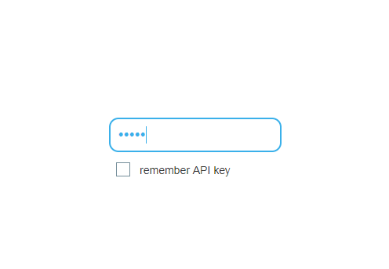
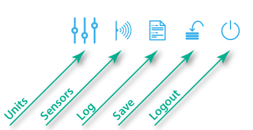
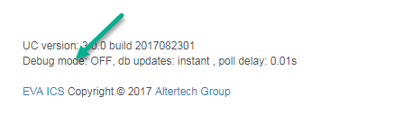
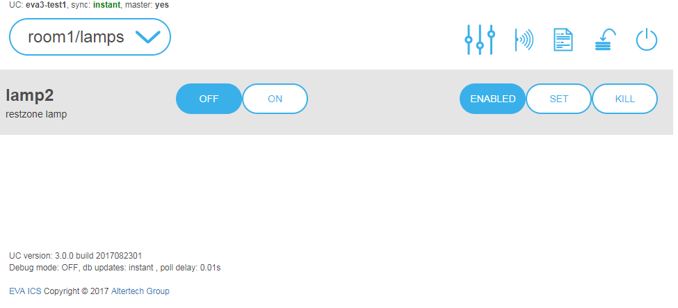
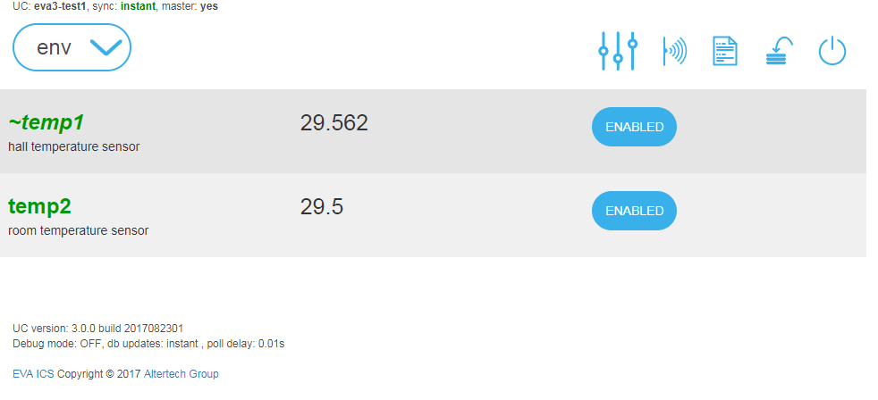
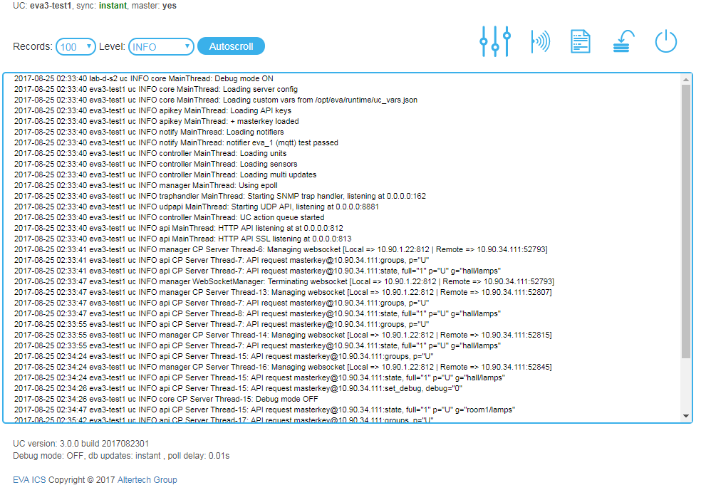

UC EI
*****

UC EI is a minimal interface for controlling the :doc:`uc` subsystem. The
interface is not intended for daily use. It is designed solely for
configuration, debugging and use in case of emergency, e. g. when the primary
system interface is unavailable.

Logging in
==========

To log into the interface, open *\http://IP_address_UC:port/* url (the default
port is 8812), enter API key and press Enter to log in or **Remember API key**
to log in and make your browser remember the key.

Navigation
==========

The navigation menu is at the top of the interface.

Use **Save** button to immediately store the runtime data base/configuration to
the disk.

System information
==================

System information is at the bottom of the interface. Clicking on the **Debug
mode** enables or disables the controller debugging mode.

Units
=====

The :ref:`units<unit>` page opens after you've logged in. On the top you see
the controller name, key type (masterkey or the regular one) and data
synchronization method (instant - via WebSocket, numeric value - via AJAX every
X seconds).

Important: when you create/delete units, the interface does not automatically
display the changes made. Use reload button or refresh the page in browser.

On the page, you can:

* execute actions commands to the units (buttons change unit status, you cannot
  set the action value from the interface)
* enable or disable the unit actions
* set status and value of the unit manually (**SET**)
* clean up the action queue and terminate the current action (**KILL**)

Sensors
=======

On the :ref:`sensors<sensor>` page you can review the current value of each
sensor, make it enabled or disabled.

Log viewer
==========

The log page allows you to review the system log since the controller launch.
If you set the report level to *DEBUG*, interface automatically prompts you to
switch the controller to debugging mode.

Disabling the interface
=======================

For security reasons, it may be a good idea to disable the interface after the
initial configuration and system debug. To do this, set
*webapi/ei-enabled:false* in *config/uc/main* :doc:`registry</registry>` key
and restart the controller.
